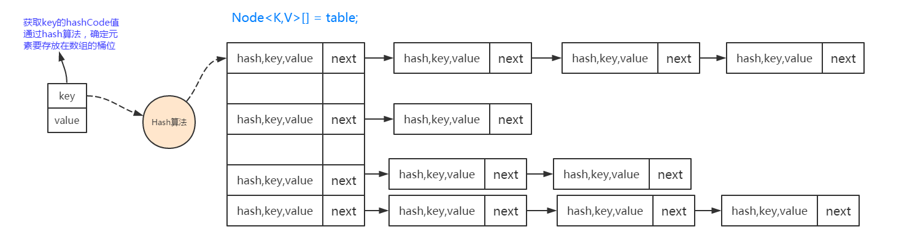

== JDK1.8 HashMap源码解析

=== HashMap简介

HashMap是基于哈希表实现的，用来存储key-value形式的键值对，允许key和value都为null值；
HashMap是非线程安全的，只是用于单线程环境下，多线程环境下可以采用concurrent并发包下的concurrentHashMap；
HashMap实现了Serializable接口，支持序列化，实现了Cloneable接口，能被克隆。

=== 签名

[source,java]
----
public class HashMap<K,V>
    extends AbstractMap<K,V>
    implements Map<K,V>, Cloneable, Serializable
----

可以看到HashMap 实现了Cloneable和Serializable标记接口：

* 标记接口Cloneable，用于表明HashMap对象会重写java.lang.Object#clone()方法，HashMap实现的是浅拷贝（shallow copy）。
* 标记接口Serializable，用于表明HashMap对象可以被序列化。

*HashMap继承了AbstractMap抽象类，同时也实现了Map接口。*

NOTE: 在语法层面继承接口Map是多余的，这么做仅仅是为了让阅读代码的人明确知道HashMap是属于Map体系的，起到了文档的作用。
AbstractMap相当于个辅助类，Map的一些操作这里面已经提供了默认实现，后面具体的子类如果没有特殊行为，可直接使用AbstractMap提供的实现。

AbstractMap相当于个辅助类，Map的一些操作这里面已经提供了默认实现，后面具体的子类如果没有特殊行为，可直接使用AbstractMap提供的实现。

=== 存储结构

HashMap是基于哈希表存储的，在JDK1.6，JDK1.7版本采用数组(位桶) + 链表实现存储元素和解决冲突，同一hash值的链表都存储在一个链表里。
但是当位于一个桶中的元素较多，即hash值相等的元素较多时，通过key值依次查找的效率较低。但是到JDK1.8版本时HashMap采用位桶 + 链表 + 红黑树实现，
当链表长度超过阈值（8）时，将链表转换为红黑树，这样大大减少了查找时间。

=== 实现原理

首先有一个元素是链表的数组，当添加一个元素（key-value）时，就首先计算元素key的hash值，以此确定元素在数组中的位置，但是可能存在同一hash值的元素
已经被放在数组同一位置了（也就出现了Hash冲突），这时就添加到同一hash值的元素的后面，他们在数组的同一位置，但是形成了链表，同一个链表上的Hash值是
相同的，所以说数组存放的是链表。而当链表长度太长时，链表就转换为红黑树，这样大大提高了查找的效率。 +
当链表数组的容量超过初始容量的0.75（阀值）时，将链表数组扩大2倍，然后把原来数组中的链表重现散列，把原链表数组的搬移到新的数组中。

HashMap原理图：

=== 源码剖析

==== 重要属性

[source,java]
----

/**
 *  序列号
 */
private static final long serialVersionUID = 362498820763181265L;

/**
 *  默认初始容量（容量为HashMap中槽的数目）是16，且必须是2的整数次幂。
 */
static final int DEFAULT_INITIAL_CAPACITY = 1 << 4; // aka 16

/**
 * 最大容量（必须是2的幂且小于2的30次方，传入容量过大将被这个值替换）
 */
static final int MAXIMUM_CAPACITY = 1 << 30;

/**
 * 默认装载因子为0.75
 */
static final float DEFAULT_LOAD_FACTOR = 0.75f;

/**
 * 当put一个元素到某个位桶，其链表长度达到8时将链表转换为红黑树
 */
static final int TREEIFY_THRESHOLD = 8;

/**
 * 一个位桶上的链表长度小于这个值时将红黑树转链表
 */
static final int UNTREEIFY_THRESHOLD = 6;

/**
 * 树的最小的容量，至少是 4 x TREEIFY_THRESHOLD = 32
 * 然后为了避免(resizing 和 treeification thresholds) 设置成64
 */
static final int MIN_TREEIFY_CAPACITY = 64;

/**
 * 实际存放元素的个数，不等于数组的长度
 */
transient int size;

/**
 * 达到这个阈值就要进行扩容，其等于容量 * 装载因子
 */
int threshold;

/**
 * 实际装载因子
 */
final float loadFactor;

/**
 * 每次扩容和更改map结构的计数器
 */
transient int modCount;

/*
 * 存放具体key-value对元素的集和
 */
transient Set<Map.Entry<K,V>> entrySet;

/*
 * 存储元素的数组，总是2的幂次倍
 */
transient Node<K,V>[] table;
----

.加载因子
****
加载因子（默认0.75）：为什么需要使用加载因子，为什么需要扩容呢？因为如果加载因子很大，
说明利用的空间很多，如果一直不进行扩容的话，链表就会越来越长，这样查找的效率很低，
因为链表的长度很大（当然最新版本使用了红黑树后会改进很多），扩容之后，将原来链表数
组的每一个链表分成奇偶两个子链表分别挂在新链表数组的散列位置，这样就减少了每个链表
的长度，增加查找效率。HashMap本来是以空间换时间，所以填充比没必要太大。但是填充比太小
又会导致空间浪费。如果关注内存，填充比可以稍大，如果主要关注查找性能，填充比可以稍小。
****

==== 数据结构
* 位桶数组

[source,java]
----
/**
 * 1.存储元素（位桶）的数组
 */
transient Node<k,v>[] table;
----

* 数组元素Node<K,V>

[source,java]
----
//Node是单向链表，它实现了Map.Entry接口
static class Node<K,V> implements Map.Entry<K,V> {
    final int hash;
    final K key;
    V value;
    Node<K,V> next;  //下一个节点

    Node(int hash, K key, V value, Node<K,V> next) {
        this.hash = hash;
        this.key = key;
        this.value = value;
        this.next = next;
    }

    public final K getKey()        { return key; }
    public final V getValue()      { return value; }
    public final String toString() { return key + "=" + value; }

    public final int hashCode() {
        return Objects.hashCode(key) ^ Objects.hashCode(value);
    }

    public final V setValue(V newValue) {
        V oldValue = value;
        value = newValue;
        return oldValue;
    }

    public final boolean equals(Object o) {
        if (o == this)
            return true;
        if (o instanceof Map.Entry) {
            Map.Entry<?,?> e = (Map.Entry<?,?>)o;
            if (Objects.equals(key, e.getKey()) &&
                    Objects.equals(value, e.getValue()))
                return true;
        }
        return false;
    }
}
----

TIP: 其实Node就是一个基于单向链表数据结构的存储key和value的一个对象。next指向下一个Node.实现了Map.Entry接口

* 红黑树

[source,java]
----
static final class TreeNode<K,V> extends LinkedHashMap.Entry<K,V> {
    TreeNode<k,v> parent;  //父节点
    TreeNode<k,v> left;    //左子树
    TreeNode<k,v> right;   //右子树
    TreeNode<k,v> prev;    // needed to unlink next upon deletion
    boolean red;           //颜色属性
    TreeNode(int hash, K key, V val, Node<K,V> next) {
        super(hash, key, val, next);
    }

    /**
     * 返回当前节点的根节点
     */
    final TreeNode<K,V> root() {
        for (TreeNode<K,V> r = this, p;;) {
            if ((p = r.parent) == null)
                return r;
            r = p;
        }
    }
----

.transient 关键字
****
Java序列化会把某一个类存储以文件形式存储在物理空间，但是以文件形式存储某些信息时，容易涉及到安全问题，因为数据位于Java运行环境之外，
不在Java安全机制的控制之中。对于这些需要保密的字段，不应保存在永久介质中 ，或者不应简单地不加处理地保存下来 ，为了保证安全性。
应该在这些字段前加上transient关键字。它的意思是临时的，即不会随类一起序列化到本地，所以当还原后，这个关键字定义的变量也就不再存在。
****

==== 构造函数

* 默认构造函数HashMap()

[source,java]
----
public HashMap() {
  //初始话加载因子为默认0.75；其他属性均为默认
  this.loadFactor = DEFAULT_LOAD_FACTOR; // all other fields defaulted
}
----

WARNING: 这是一个默认构造器，潜在的问题是初始容量16太小了，可能中间需要不断扩容的问题，会影响插入的效率。

* 指定初始容量和加载因子的构造函数HashMap(int, float)

[source,java]
----
public HashMap(int initialCapacity, float loadFactor) {
    //初始容量不能小于0
    if (initialCapacity < 0)
        throw new IllegalArgumentException("Illegal initial capacity: " +
                initialCapacity);
    // 初始容量不能大于最大值，否则为最大值
    if (initialCapacity > MAXIMUM_CAPACITY)
        initialCapacity = MAXIMUM_CAPACITY;
    // 填充因子不能小于或等于0，不能为非数字
    if (loadFactor <= 0 || Float.isNaN(loadFactor))
        throw new IllegalArgumentException("Illegal load factor: " +
                loadFactor);
    //初始话加载因子
    this.loadFactor = loadFactor;
    //初始化(阀值)threshold，数组元素数量达到该值时会扩容
    this.threshold = tableSizeFor(initialCapacity);
}

/**
 * tableSizeFor的功能主要是用来保证容量应该大于cap,且为2的整数
 */
static final int tableSizeFor(int cap) {
      int n = cap - 1;
      n |= n >>> 1;
      n |= n >>> 2;
      n |= n >>> 4;
      n |= n >>> 8;
      n |= n >>> 16;
      return (n < 0) ? 1 : (n >= MAXIMUM_CAPACITY) ? MAXIMUM_CAPACITY : n + 1;
}
----

[qanda]
这里可能还有一个疑问，明明给的是初始容量，为什么要计算阀值，而不是容量呢？::
其实这也是jdk1.8的改变，它将table的初始化放入了resize()中，而且压根就没有capacity这个属性，
所以这里只能重新计算threshold，而resize()后面就会根据threshold来重新计算capacity，来进行
table数组的初始化，然后在重新按照装载因子计算threshold。

TIP: 可以指定初始容量，以及装载因子，但是一般情况下指定装载因子意义不大，采用默认0.75就可以。

* 指定初始容量的构造函数HashMap(int initialCapacity)

[source,java]
----
public HashMap(int initialCapacity) {
    this(initialCapacity, DEFAULT_LOAD_FACTOR);
}
----

TIP: 用这种构造函数创建HashMap的对象，如果知道map要存放的元素个数，可以直接指定容量的大小，
减除不停的扩容，提高效率

* 将已有Map放入当前map的构造函数HashMap(Map<? extends K, ? extends V> m)

[source,java]
----
public HashMap(Map<? extends K, ? extends V> m) {
   this.loadFactor = DEFAULT_LOAD_FACTOR;  //初始化加载因子
   putMapEntries(m, false);
}

// 其实就是一个一个取出m中的元素调用putVal,一个个放入table中的过程。
final void putMapEntries(Map<? extends K, ? extends V> m, boolean evict) {
    int s = m.size();
    if (s > 0) {
        if (table == null) { // pre-size
            float ft = ((float)s / loadFactor) + 1.0F;
            int t = ((ft < (float)MAXIMUM_CAPACITY) ?
                    (int)ft : MAXIMUM_CAPACITY);
            if (t > threshold)
                threshold = tableSizeFor(t);
        }
        else if (s > threshold)   //如果m中的元素个数大于阀值，调用resize进行扩容
            resize();
        for (Map.Entry<? extends K, ? extends V> e : m.entrySet()) {
            K key = e.getKey();
            V value = e.getValue();
            putVal(hash(key), key, value, false, evict);  //调用putVal向map中添加元素
        }
    }
}
----

==== HashMap存取机制

===== 1.添加元素

[source,java]
----
public V put(K key, V value) {
    return putVal(hash(key), key, value, false, true);    //调用putVal()方法
}
----
JDK1.8计算hash值
[source,java]
----
static final int hash(Object key) {
    int h;
    return (key == null) ? 0 : (h = key.hashCode()) ^ (h >>> 16);
}
----
JDK1.7计算hash值
[source,java]
----
final int hash(Object k) {
    int h = hashSeed;
    if (0 != h && k instanceof String) {
        return sun.misc.Hashing.stringHash32((String) k);
    }
    h ^= k.hashCode();
    h ^= (h >>> 20) ^ (h >>> 12);
    return h ^ (h >>> 7) ^ (h >>> 4);
}
----
NOTE: JDK1.8计算hash值的方法进行了改进，取得key的hashcode后，高16位与低16位异或运算重新计算hash值。
key有可能是null，key为null时，hash值为0，放在数组的0位置。

put方法实现的主要方法putVal()::
[source,java]
----
final V putVal(int hash, K key, V value, boolean onlyIfAbsent, boolean evict) {
    Node<K,V>[] tab; Node<K,V> p; int n, i;
    //table未初始化或者长度为0，进行扩容
    if ((tab = table) == null || (n = tab.length) == 0)
        //可以看到put元素时，如果数组没有初始化，会调用resize()方法进行初始化。后面分析resize()方法
        n = (tab = resize()).length;

    /*
     * 这里就是HASH算法了，用来定位桶位的方式，可以看到是采用容量-1和键的hash值进行与运算
     * n-1,的原因就是n一定是一个2的整数幂，而(n - 1) & hash其实质就是n%hash,但是取余运算
     * 的效率明显不如位运算与，并且(n - 1) & hash也能保证散列均匀，不会产生只有偶数位有值的现象
     */
    if ((p = tab[i = (n - 1) & hash]) == null)
        /*
         * 当这里是空桶位时，就直接构造新的Node节点，将其放入桶位中(此时，这个结点是放在数组中)
         * newNode()方法，就是对new Node(,,,)的包装,同时也可以看到Node中的hash值就是重新计算的hash(key)
         */
        tab[i] = newNode(hash, key, value, null);
    else {
        //桶中已经存在元素
        Node<K,V> e; K k;
        // 比较桶中第一个元素(数组中的结点)的hash值相等，key相等
        if (p.hash == hash && ((k = p.key) == key || (key != null && key.equals(k))))
            //比较桶中第一个元素(数组中的结点)的hash值相等，key相等
            e = p;
        else if (p instanceof TreeNode)
            // hash值不相等，即key不相等；为红黑树结点
            e = ((TreeNode<K,V>)p).putTreeVal(this, tab, hash, key, value);  // 放入树中
        else {
            // 为链表结点
            // 在链表最末插入结点
            for (int binCount = 0; ; ++binCount) {
              // 到达链表的尾部
                if ((e = p.next) == null) {
                    // 在尾部插入新结点
                    p.next = newNode(hash, key, value, null);
                    // 结点数量达到阈值，转化为红黑树
                    if (binCount >= TREEIFY_THRESHOLD - 1) // -1 for 1st
                        treeifyBin(tab, hash);
                    break; // 跳出循环
                }
                // 判断链表中结点的key值与插入的元素的key值是否相等
                if (e.hash == hash && ((k = e.key) == key || (key != null && key.equals(k))))
                    break;   // 相等，跳出循环
                // 用于遍历桶中的链表，与前面的e = p.next组合，可以遍历链表
                p = e;
            }
        }
        // 表示在桶中找到key值、hash值与插入元素相等的结点
        if (e != null) { // existing mapping for key
            V oldValue = e.value;  // 记录e的value
            // onlyIfAbsent为false或者旧值为null
            if (!onlyIfAbsent || oldValue == null)
                e.value = value;  //用新值替换旧值
            afterNodeAccess(e);   // 访问后回调
            return oldValue;      // 返回旧值
        }
    }
    // 结构性修改
    ++modCount;
    // 实际大小大于阈值则扩容
    if (++size > threshold)
        resize();
    afterNodeInsertion(evict);  // 插入后回调
    return null;  // 返回null
}
----

resize()方法::

[source,java]
----
final Node<K,V>[] resize() {
    // 当前table保存
    Node<K,V>[] oldTab = table;
    // 保存table大小
    int oldCap = (oldTab == null) ? 0 : oldTab.length;
    // 保存当前阈值
    int oldThr = threshold;
    int newCap, newThr = 0;
    // 之前table大小大于0
    if (oldCap > 0) {
        // 之前table大于最大容量
        if (oldCap >= MAXIMUM_CAPACITY) {
            // 阈值为最大整形
            threshold = Integer.MAX_VALUE;
            return oldTab;
        }
        // 容量翻倍，使用左移，效率更高
        else if ((newCap = oldCap << 1) < MAXIMUM_CAPACITY &&
            oldCap >= DEFAULT_INITIAL_CAPACITY)
            // 阈值翻倍
            newThr = oldThr << 1; // double threshold
    }
    // 之前阈值大于0
    else if (oldThr > 0)
        newCap = oldThr;
    // oldCap = 0并且oldThr = 0，使用缺省值（如使用HashMap()构造函数，之后再插入一个元素会调用resize函数，会进入这一步）
    else {
        newCap = DEFAULT_INITIAL_CAPACITY;
        newThr = (int)(DEFAULT_LOAD_FACTOR * DEFAULT_INITIAL_CAPACITY);
    }
    // 新阈值为0
    if (newThr == 0) {
        float ft = (float)newCap * loadFactor;
        newThr = (newCap < MAXIMUM_CAPACITY && ft < (float)MAXIMUM_CAPACITY ?
                  (int)ft : Integer.MAX_VALUE);
    }
    threshold = newThr;
    @SuppressWarnings({"rawtypes","unchecked"})
    // 初始化table
    Node<K,V>[] newTab = (Node<K,V>[])new Node[newCap];
    table = newTab;
    // 之前的table已经初始化过
    if (oldTab != null) {
        // 复制元素，重新进行hash
        for (int j = 0; j < oldCap; ++j) {
            Node<K,V> e;
            if ((e = oldTab[j]) != null) {
                oldTab[j] = null;
                if (e.next == null)
                    newTab[e.hash & (newCap - 1)] = e;
                else if (e instanceof TreeNode)
                    ((TreeNode<K,V>)e).split(this, newTab, j, oldCap);
                else { // preserve order
                    Node<K,V> loHead = null, loTail = null;
                    Node<K,V> hiHead = null, hiTail = null;
                    Node<K,V> next;
                    // 将同一桶中的元素根据(e.hash & oldCap)是否为0进行分割，分成两个不同的链表，完成rehash
                    do {
                        next = e.next;
                        if ((e.hash & oldCap) == 0) {
                            if (loTail == null)
                                loHead = e;
                            else
                                loTail.next = e;
                            loTail = e;
                        }
                        else {
                            if (hiTail == null)
                                hiHead = e;
                            else
                                hiTail.next = e;
                            hiTail = e;
                        }
                    } while ((e = next) != null);
                    if (loTail != null) {
                        loTail.next = null;
                        newTab[j] = loHead;
                    }
                    if (hiTail != null) {
                        hiTail.next = null;
                        newTab[j + oldCap] = hiHead;
                    }
                }
            }
        }
    }
    return newTab;
}
----

TIP: 扩容实际上就是创建一个容量是原来容量两倍的数组，
把原来数组中的元素经过重新散列，然后添加到新的数组中。
扩容会伴随着一次重新hash分配，并且会遍历hash表中所有
的元素，是非常耗时的。在编写程序中，要尽量避免resize。

putAll()方法::
[source,java]
----
public void putAll(Map<? extends K, ? extends V> m) {
  //内部也是调用putVal()方法，将m中的元素循环放入table中
  putMapEntries(m, true);
}
----

===== 获取元素

[source,java]
----
/**
 * 通过key获取value
 */
public V get(Object key) {
    Node<K,V> e;
    return (e = getNode(hash(key), key)) == null ? null : e.value;
}

final Node<K,V> getNode(int hash, Object key) {
    Node<K,V>[] tab; Node<K,V> first, e; int n; K k;
    if ((tab = table) != null && (n = tab.length) > 0 &&
        (first = tab[(n - 1) & hash]) != null) {
        //如果Node链表的第一个元素相等
        if (first.hash == hash && // always check first node
            ((k = first.key) == key || (key != null && key.equals(k))))
            return first;
        if ((e = first.next) != null) {
            //红黑树查找
            if (first instanceof TreeNode)
                return ((TreeNode<K,V>)first).getTreeNode(hash, key);
            //链表查找
            do {
                if (e.hash == hash &&
                    ((k = e.key) == key || (key != null && key.equals(k))))
                    return e;
            } while ((e = e.next) != null);
        }
    }
    //找不到返回null
    return null;
}

/**
 * 判断是否包含指定key
 */
public boolean containsKey(Object key) {
    return getNode(hash(key), key) != null;  //返回node是否为null
}

/**
 * 判断是否包含指定value
 */
public boolean containsValue(Object value) {
    Node<K,V>[] tab; V v;
    if ((tab = table) != null && size > 0) {
        for (int i = 0; i < tab.length; ++i) {
            //按照单链表的方式进行遍历，
            //因为HashMap中 TreeNode 节点也存在next成员，可以用链表的方式进行遍历
            for (Node<K,V> e = tab[i]; e != null; e = e.next) {
                if ((v = e.value) == value ||
                        (value != null && value.equals(v)))
                    return true;
            }
        }
    }
    return false;
}
----

NOTE: get方法相对put要简单的多，分析源码可以看出hash算法的精髓，不用遍历就可以直接通过
计算key的hash值，得到查找元素在数组中的桶位，然后比较hash值、key是否相等来获取node。
