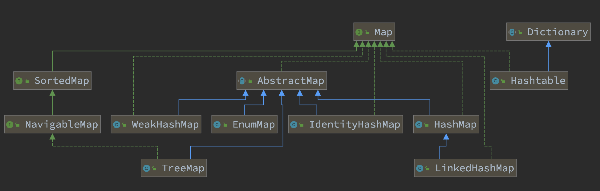
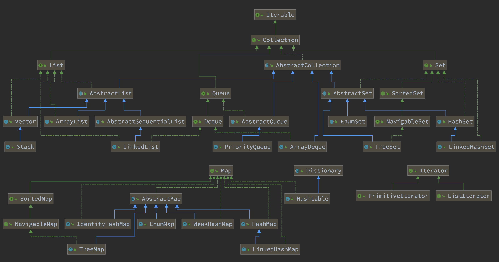

= JDK & STL 源码分析计划

为了学好数据结构以及相关算法，同时也为了更好地理解 JDK 的底层实现，计划对 JDK 集合类的源码做一个系统的阅读分析。

欢迎感兴趣的小伙伴提交 PR 或 Issue。

WARNING: 本文档基于 *JDK 1.8.0_201* 的代码开展分析，请 PR 的小伙伴使用相同的 JDK。谢谢！

== 总体思路

. 学习基本的数据结构认识。兵马未动粮草先行。先把基础理论搞清楚。
.. 学Java的，可以从下面两本书中选一本：
... https://book.douban.com/subject/26745780/[数据结构与算法分析] -- 这本书的优点在于和 Java JDK 的集合类很贴近。
... https://book.douban.com/subject/19952400/[算法（第4版）] -- 这本书胜在图很多。
.. 学 C/C++ 的，可以看下面这套书：
... https://book.douban.com/subject/4065258/[算法：C语言实现 (第1～4部分)]
... https://book.douban.com/subject/4191525/[算法：C语言实现 （第5部分）]
. 自己实现一遍基本的数据结构；
. 阅读 JDK 或 STL 源码，做学习笔记。
+
TIP: 对比一下自己的实现和这些经典代码的实现，总结自己差距，提高自己的编码能力。
+
.. https://book.douban.com/subject/1110934/[STL源码剖析 ] -- 阅读源码时，建议参考一下本书的内容。
.. 建议把网上的源码分析笔记都看一看，取长补短，补充自己的分析。
.. 建议把网上相关面试题也看一看，检验自己的学习成果。
. 相关联的 LeetCode 上的题都刷掉。

[NOTE]
====
还有两个想法：

. 可以把 Redis 的实现也过一下，Redis 实现也有很多不错的思路。毕竟 Redis 是目前最常用的缓存解决方案。
. Java 中有很多针对集合类做扩展的库，可以一并学了，这样就能更清楚了解 Java JDK 实现的不足，开阔自己的眼界：
.. https://github.com/google/guava[google/guava: Google core libraries for Java]
.. https://commons.apache.org/proper/commons-collections/[Apache Commons Collections]
.. https://www.eclipse.org/collections/[Eclipse Collections - Features you want with the collections you need.]
====

== JDK 集合类

*Base + Iterator*::
代码总行数： 103 + 118 + 302 + 195 + 832 + 79 + 604 + 469 = 2702 行，预计 5 个小时。
. `java.lang.Iterable`
. `java.util.Iterator`
. `java.util.PrimitiveIterator`
. `java.util.ListIterator`
. `java.util.Spliterator`
. `java.util.Enumeration`
. `java.util.Collection`
. `java.util.AbstractCollection`

*List*::
代码总行数： 734 + 781 + 253 + 1262 + 1456 + 141 + 1468 = 6095 行，预计 12 个小时。
. `java.util.List`
. `java.util.AbstractList`
. `java.util.AbstractSequentialList`
. `java.util.LinkedList`
. `java.util.Vector`
. `java.util.Stack`
. `java.util.ArrayList`

*Queue*::
代码总行数： 218 + 584 + 192 + 992 + 907 = 2893 行，预计 6 个小时。
. `java.util.Queue`
. `java.util.Deque`
. `java.util.AbstractQueue`
. `java.util.ArrayDeque`
. `java.util.PriorityQueue`

*Set*::
代码总行数： 413 + 186 + 264 + 464 + 319 + 361 + 560 + 195 + 1248 = 4010 行，预计 8 个小时。
. `java.util.Set`
. `java.util.AbstractSet`
. `java.util.SortedSet`
. `java.util.EnumSet`
. `java.util.NavigableSet`
. `java.util.HashSet`
. `java.util.TreeSet`
. `java.util.LinkedHashSet`
. `java.util.BitSet`

image::./docs/images/java.util.Collection.png[]

*Map*::
代码总行数： 1183 + 284 + 424 + 860 + 3019 + 1339 + 812 + 1600 + 756 + 2397 + 155 + 1422 = 14251 行，预计 28 个小时。
. `java.util.Map`
. `java.util.SortedMap`
. `java.util.NavigableMap`
. `java.util.AbstractMap`
. `java.util.TreeMap`
. `java.util.WeakHashMap`
. `java.util.EnumMap`
. `java.util.IdentityHashMap`
. `java.util.LinkedHashMap`
. `java.util.HashMap`
. `java.util.Dictionary`
. `java.util.Hashtable`

来张总体结构图：

TIP: 这里没有包含并发相关的集合类。这块内容放到并发中一起搞。

== 目录结构介绍

[source]
----
.
├── LICENSE
├── README.adoc
├── pom.xml
├── docs -- 这里存放阅读源码的文档。
│   └── images -- 这里存放相关图片
└── src
    ├── main
    │   └── java
    │       └── com
    │           └── diguage
    │               └── truman
    │                   └── App.java
    └── test
        └── java
            └── com
                └── diguage
                    └── truman  -- 这个目录存放相关测试代码。
                        └── AppTest.java
----

== 源码列表

* [x] link:./docs/java.util.Iterator.adoc[迭代器 Iterator、Enumeration、Spliterator 与 Iterable]
* [ ] link:./docs/java.util.PrimitiveIterator.adoc[java.util.PrimitiveIterator]
* [ ] link:./docs/java.util.ListIterator.adoc[java.util.ListIterator]
* [ ] link:./docs/java.util.Spliterator.adoc[java.util.Spliterator]
* [ ] link:./docs/java.util.Collection.adoc[java.util.Collection]
* [ ] link:./docs/java.util.AbstractCollection.adoc[java.util.AbstractCollection]
* [ ] link:./docs/java.util.List.adoc[java.util.List]
* [ ] link:./docs/java.util.AbstractList.adoc[java.util.AbstractList]
* [ ] link:./docs/java.util.AbstractSequentialList.adoc[java.util.AbstractSequentialList]
* [ ] link:./docs/java.util.LinkedList.adoc[java.util.LinkedList]
* [ ] link:./docs/java.util.Vector.adoc[java.util.Vector]
* [ ] link:./docs/java.util.Stack.adoc[java.util.Stack]
* [ ] link:./docs/java.util.ArrayList.adoc[java.util.ArrayList]
* [ ] link:./docs/java.util.Queue.adoc[java.util.Queue]
* [ ] link:./docs/java.util.Deque.adoc[java.util.Deque]
* [ ] link:./docs/java.util.AbstractQueue.adoc[java.util.AbstractQueue]
* [ ] link:./docs/java.util.ArrayDeque.adoc[java.util.ArrayDeque]
* [ ] link:./docs/java.util.PriorityQueue.adoc[java.util.PriorityQueue]
* [ ] link:./docs/java.util.Set.adoc[java.util.Set]
* [ ] link:./docs/java.util.AbstractSet.adoc[java.util.AbstractSet]
* [ ] link:./docs/java.util.SortedSet.adoc[java.util.SortedSet]
* [ ] link:./docs/java.util.EnumSet.adoc[java.util.EnumSet]
* [ ] link:./docs/java.util.NavigableSet.adoc[java.util.NavigableSet]
* [ ] link:./docs/java.util.HashSet.adoc[java.util.HashSet]
* [ ] link:./docs/java.util.TreeSet.adoc[java.util.TreeSet]
* [ ] link:./docs/java.util.LinkedHashSet.adoc[java.util.LinkedHashSet]
* [ ] link:./docs/java.util.BitSet.adoc[java.util.BitSet]
* [ ] link:./docs/java.util.Map.adoc[java.util.Map]
* [ ] link:./docs/java.util.SortedMap.adoc[java.util.SortedMap]
* [ ] link:./docs/java.util.NavigableMap.adoc[java.util.NavigableMap]
* [ ] link:./docs/java.util.AbstractMap.adoc[java.util.AbstractMap]
* [ ] link:./docs/java.util.TreeMap.adoc[java.util.TreeMap]
* [ ] link:./docs/java.util.WeakHashMap.adoc[java.util.WeakHashMap]
* [ ] link:./docs/java.util.EnumMap.adoc[java.util.EnumMap]
* [ ] link:./docs/java.util.IdentityHashMap.adoc[java.util.IdentityHashMap]
* [ ] link:./docs/java.util.LinkedHashMap.adoc[java.util.LinkedHashMap]
* [ ] link:./docs/java.util.HashMap.adoc[java.util.HashMap]
* [ ] link:./docs/java.util.Dictionary.adoc[java.util.Dictionary]
* [ ] link:./docs/java.util.Hashtable.adoc[java.util.Hashtable]
