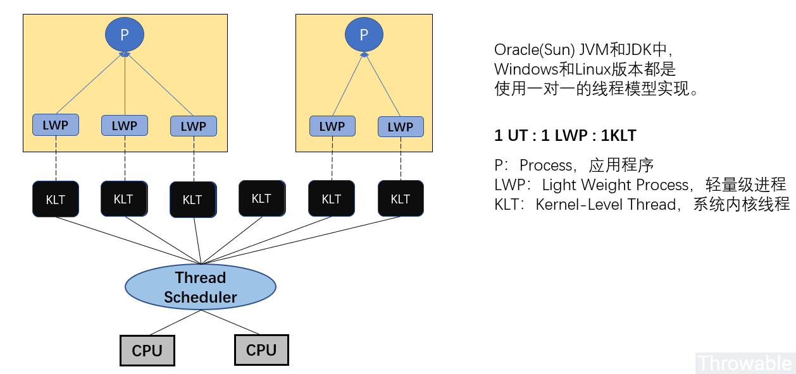
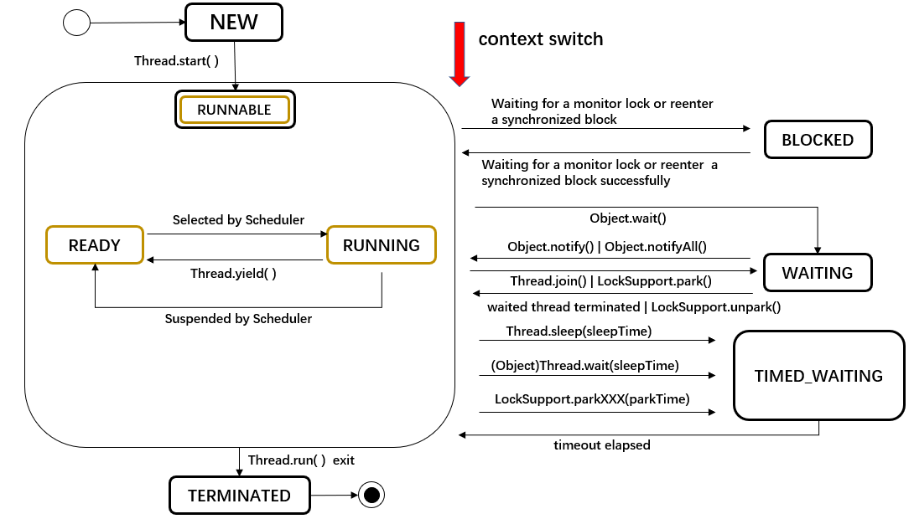
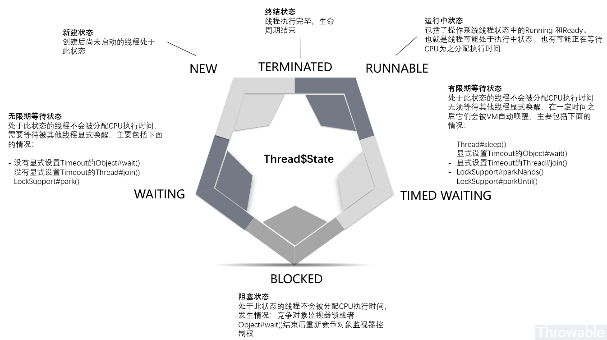

[#lang-Thread]
= Thread

在JDK1.2之后，Java线程模型已经确定了基于操作系统原生线程模型实现。

Java线程最终会映射为系统内核原生线程，所以Java线程调度最终取决于系操作系统，而目前主流的操作系统内核线程调度基本都是使用抢占式线程调度。也就是可以死记硬背一下：**Java线程是使用抢占式线程调度方式进行线程调度的。**

线程状态在 `Thread` 类已经通过一个枚举给出了所有可能：

.Thread
[{java_src_attr}]
----
public class Thread implements Runnable {
    // ……
    /**
     * A thread state.  A thread can be in one of the following states:
     * <ul>
     * <li>{@link #NEW} 
     *     A thread that has not yet started is in this state.
     *     </li>
     * <li>{@link #RUNNABLE} 
     *     A thread executing in the Java virtual machine is in this state.
     *     </li>
     * <li>{@link #BLOCKED} 
     *     A thread that is blocked waiting for a monitor lock
     *     is in this state.
     *     </li>
     * <li>{@link #WAITING} 
     *     A thread that is waiting indefinitely for another thread to
     *     perform a particular action is in this state.
     *     </li>
     * <li>{@link #TIMED_WAITING} 
     *     A thread that is waiting for another thread to perform an action
     *     for up to a specified waiting time is in this state.
     *     </li>
     * <li>{@link #TERMINATED} 
     *     A thread that has exited is in this state.
     *     </li>
     * </ul>
     *
     * 

     * A thread can be in only one state at a given point in time.
     * These states are virtual machine states which do not reflect
     * any operating system thread states.
     *
     * @since   1.5
     * @see #getState
     */
    public enum State {
        /**
         * Thread state for a thread which has not yet started.
         */
        NEW,

        /**
         * Thread state for a runnable thread.  A thread in the runnable
         * state is executing in the Java virtual machine but it may
         * be waiting for other resources from the operating system
         * such as processor.
         */
        RUNNABLE,

        /**
         * Thread state for a thread blocked waiting for a monitor lock.
         * A thread in the blocked state is waiting for a monitor lock
         * to enter a synchronized block/method or
         * reenter a synchronized block/method after calling
         * {@link Object#wait() Object.wait}.
         */
        BLOCKED,

        /**
         * Thread state for a waiting thread.
         * A thread is in the waiting state due to calling one of the
         * following methods:
         * <ul>
         *   <li>{@link Object#wait() Object.wait} with no timeout</li>
         *   <li>{@link #join() Thread.join} with no timeout</li>
         *   <li>{@link LockSupport#park() LockSupport.park}</li>
         * </ul>
         *
         * 
A thread in the waiting state is waiting for another thread to
         * perform a particular action.
         *
         * For example, a thread that has called {@code Object.wait()}
         * on an object is waiting for another thread to call
         * {@code Object.notify()} or {@code Object.notifyAll()} on
         * that object. A thread that has called {@code Thread.join()}
         * is waiting for a specified thread to terminate.
         */
        WAITING,

        /**
         * Thread state for a waiting thread with a specified waiting time.
         * A thread is in the timed waiting state due to calling one of
         * the following methods with a specified positive waiting time:
         * <ul>
         *   <li>{@link #sleep Thread.sleep}</li>
         *   <li>{@link Object#wait(long) Object.wait} with timeout</li>
         *   <li>{@link #join(long) Thread.join} with timeout</li>
         *   <li>{@link LockSupport#parkNanos LockSupport.parkNanos}</li>
         *   <li>{@link LockSupport#parkUntil LockSupport.parkUntil}</li>
         * </ul>
         */
        TIMED_WAITING,

        /**
         * Thread state for a terminated thread.
         * The thread has completed execution.
         */
        TERMINATED;
    }

    // ……
}
----

Java 对象内存占用大小：

. 对象头在32位系统上占用8bytes，64位系统上占用16bytes。开启（-XX:+UseCompressedOops）对象头大小为12bytes（64位机器）。
. 64位机器上，数组对象的对象头占用24个字节，启用压缩之后占用16个字节。之所以比普通对象占用内存多是因为需要额外的空间存储数组的长度。
. 64位机器上reference类型占用8个字节，开启指针压缩后占用4个字节。
. 复合对象，直接计算当前对象占用空间大小，包括当前类及超类的基本类型实例字段大小、引用类型实例字段引用大小、实例基本类型数组总占用空间、实例引用类型数组引用本身占用空间大小; 但是不包括超类继承下来的和当前类声明的实例引用字段的对象本身的大小、实例引用数组引用的对象本身的大小。
. 对齐填充是以每个对象为单位进行的。

HotSpot的对齐方式为8字节对齐： `（对象头 + 实例数据 + padding） % 8等于0且0 <= padding < 8`。

[{java_src_attr}]
----
include::{sourcedir}/concurrent/JolTest.java[]
----

`join()` 方法的本质是当前线程对象实例调用线程 `wait()` 方法。

[{java_src_attr}]
----
include::{sourcedir}/concurrent/ThreadTest.java[]
----

线程休眠苏醒后，中断信号就会被清除！所以，如果要响应这种中断，还需要再异常捕获代码段再次中断才行！

线程上下文切换(`Context Switch`)，都保存了哪些信息？怎么保存的？

* Windows 系统中，https://docs.microsoft.com/zh-cn/sysinternals/downloads/process-explorer[Process Explorer] 可以查看上下文切换信息。
* 阿里巴巴推出的 https://github.com/alibaba/arthas[Alibaba Arthas] 也是一个诊断利器。

== 参考资料

. http://www.throwable.club/2019/06/23/java-concurrency-thread-state/[Java线程生命周期与状态切换 - Throwable's Blog]
. https://www.iteye.com/blog/yueyemaitian-2033046[一个对象占用多少字节？ - 田麦 - ITeye博客]
. https://www.cnblogs.com/zhanjindong/p/3757767.html[一个Java对象到底占用多大内存？ - zhanjindong - 博客园]
. https://zhuanlan.zhihu.com/p/45667127[一文搞懂 Java 线程中断 - 知乎]
. https://blog.csdn.net/justloveyou_/article/details/54929949[Java 并发：线程间通信与协作_Java_Rico's Blogs-CSDN博客]
. https://blog.csdn.net/zheng548/article/details/54426947[synchronized和锁(ReentrantLock) 区别_Java_小风筝-CSDN博客]
