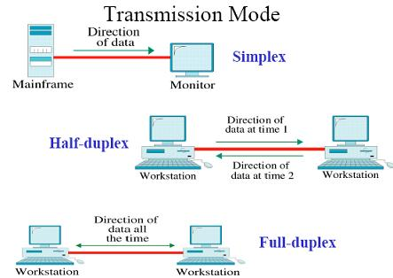

= ServerSocket

include::_attributes.adoc[]

在纠结了 N 久之后，终于动手写程序完成了 Socket 全双工实验。实验证实，Socket 在接受的同时，还可以发送报文。

[source,java,{source_attr}]
----
include::{sourcedir}/net/SocketFullDuplexTest.java[]
----

== 参考资料

. http://hafizahabdullah.blogspot.com/2013/08/fp303-cn-simplex-half-duplex-and-full.html[P2E for Students: FP303 CN: Simplex, Half-Duplex and Full-Duplex]