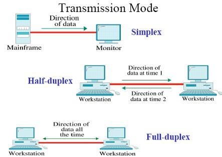

[[java.net.ServerSocket]]
= ServerSocket

在纠结了 N 久之后，终于动手写程序完成了 Socket 全双工实验。实验证实，Socket 在接受的同时，还可以发送报文。

[{java_src_attr}]
----
include::{sourcedir}/net/SocketFullDuplexTest.java[]
----

image::image-2022-02-15-17-56-18-693.png[]

image::image-2022-02-15-17-57-07-482.png[]

== 参考资料

. http://hafizahabdullah.blogspot.com/2013/08/fp303-cn-simplex-half-duplex-and-full.html[P2E for Students: FP303 CN: Simplex, Half-Duplex and Full-Duplex]
