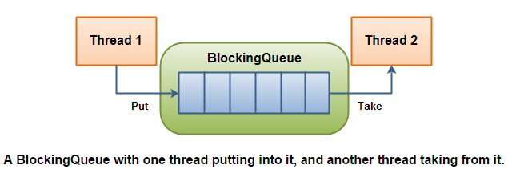

= ArrayBlockingQueue

include::_attributes.adoc[]

== 方法组

[cols="8,45,34,13"]
|===
| |插入 |移除 |检查

|抛异常
|`boolean add(E e)`
|`boolean remove(Object o)`
|`E element()`

|特定值
|`boolean offer(E e)`
|`E poll()`
|`E peek()`

|阻塞
|`void put(E e)`
|`E take()`
|

|超时
|`boolean offer(E e, long timeout, TimeUnit unit)`
|`E poll(long timeout, TimeUnit unit)`
|
|===

四组方法：

* **抛异常**：如果试图的操作无法立即执行，抛一个异常。
* **特定值**：如果试图的操作无法立即执行，返回一个特定的值(通常是 `true`, `false` 或 `null`)。
* **阻塞**：如果试图的操作无法立即执行，该方法调用将会发生阻塞，直到能够执行。
* **超时**：如果试图的操作无法立即执行，该方法调用将会发生阻塞，直到能够执行，但等待时间不会超过给定值。返回一个特定值以告知该操作是否成功(典型的是 true / false)。

`ArrayBlockingQueue` 是 `BlockingQueue` 接口的有界队列实现类，底层采用数组来实现。`ArrayBlockingQueue` 一旦创建，容量不能改变。

`ArrayBlockingQueue` 默认情况下不能保证线程访问队列的公平性，所谓公平性是指严格按照线程等待的绝对时间顺序，即最先等待的线程能够最先访问到 `ArrayBlockingQueue`。而非公平性则是指访问 `ArrayBlockingQueue` 的顺序不是遵守严格的时间顺序，有可能存在，当 `ArrayBlockingQueue` 可以被访问时，长时间阻塞的线程依然无法访问到 `ArrayBlockingQueue`。如果保证公平性，通常会降低吞吐量。

[source,java,{source_attr}]
----
/**
 * Inserts element at current put position, advances, and signals.
 * Call only when holding lock.
 */
private void enqueue(E e) {
    // assert lock.isHeldByCurrentThread();
    // assert lock.getHoldCount() == 1;
    // assert items[putIndex] == null;
    final Object[] items = this.items;
    items[putIndex] = e;
    if (++putIndex == items.length) putIndex = 0;
    count++;
    notEmpty.signal();
}

/**
 * Extracts element at current take position, advances, and signals.
 * Call only when holding lock.
 */
private E dequeue() {
    // assert lock.isHeldByCurrentThread();
    // assert lock.getHoldCount() == 1;
    // assert items[takeIndex] != null;
    final Object[] items = this.items;
    @SuppressWarnings("unchecked")
    E e = (E) items[takeIndex];
    items[takeIndex] = null;
    if (++takeIndex == items.length) takeIndex = 0;
    count--;
    if (itrs != null)
        itrs.elementDequeued();
    notFull.signal();
    return e;
}

/**
 * Inserts the specified element at the tail of this queue if it is
 * possible to do so immediately without exceeding the queue's capacity,
 * returning {@code true} upon success and throwing an
 * {@code IllegalStateException} if this queue is full.
 *
 * @param e the element to add
 * @return {@code true} (as specified by {@link Collection#add})
 * @throws IllegalStateException if this queue is full
 * @throws NullPointerException if the specified element is null
 */
public boolean add(E e) {
    return super.add(e);
}

/**
 * Inserts the specified element at the tail of this queue if it is
 * possible to do so immediately without exceeding the queue's capacity,
 * returning {@code true} upon success and {@code false} if this queue
 * is full.  This method is generally preferable to method {@link #add},
 * which can fail to insert an element only by throwing an exception.
 *
 * @throws NullPointerException if the specified element is null
 */
public boolean offer(E e) {
    Objects.requireNonNull(e);
    final ReentrantLock lock = this.lock;
    lock.lock();
    try {
        if (count == items.length)
            return false;
        else {
            enqueue(e);
            return true;
        }
    } finally {
        lock.unlock();
    }
}

public E poll() {
    final ReentrantLock lock = this.lock;
    lock.lock();
    try {
        return (count == 0) ? null : dequeue();
    } finally {
        lock.unlock();
    }
}
----

底层使用数组来实现，长度确定后就不再变化，通过下标循环往复地使用数组，类似与将数组组成了一个圆。

[source,java,{source_attr}]
----
include::{sourcedir}/concurrent/ArrayBlockingQueueTest.java[]
----

`poll(long, java.util.concurrent.TimeUnit)` 方法，其实就是使用 `Condition notEmpty` 对象来调用 `ConditionObject.awaitNanos(long)` 方法，在其中再调用了 xref:java.util.concurrent.locks.LockSupport.adoc[`LockSupport.parkNanos(java.lang.Object, long)`] 方法来实现"休眠等待"。

== 参考资料

* https://www.pdai.tech/md/java/thread/java-thread-x-juc-collection-BlockingQueue.html[JUC集合: BlockingQueue详解 | Java 全栈知识体系]
