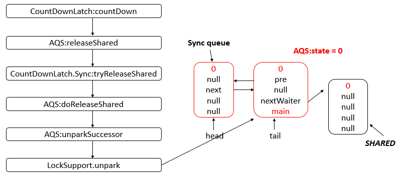
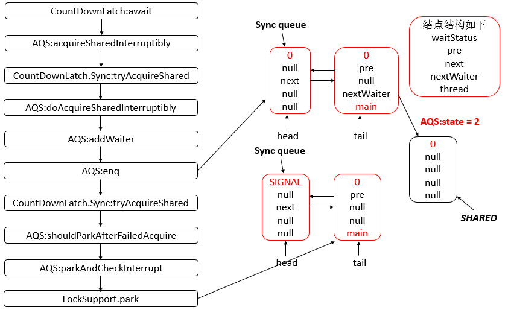

== CountDownLatch

include::_attributes.adoc[]

"Count Down" 在英语中意为倒计数，一个典型场景就是火箭🚀发射时的倒计时。

[source,java,{source_attr}]
----
include::{sourcedir}/concurrent/CountDownLatchTest.java[]
----

下面，我们开始看 `CountDownLatch` 源码：

`CountDownLatch` 类中存在一个内部类 `Sync`，继承自 `AbstractQueuedSynchronizer`，代码如下：

[source,java,{source_attr}]
----
/**
 * Synchronization control For CountDownLatch.
 * Uses AQS state to represent count.
 */
private static final class Sync extends AbstractQueuedSynchronizer {
    private static final long serialVersionUID = 4982264981922014374L;

    Sync(int count) {
        setState(count);
    }

    int getCount() {
        return getState();
    }

    protected int tryAcquireShared(int acquires) {
        return (getState() == 0) ? 1 : -1;
    }

    protected boolean tryReleaseShared(int releases) {
        // Decrement count; signal when transition to zero
        for (;;) {
            int c = getState();
            if (c == 0)
                return false;
            int nextc = c - 1;
            if (compareAndSetState(c, nextc))
                return nextc == 0;
        }
    }
}

private final Sync sync;
----

管中窥豹，从这里也可以看出 `CountDownLatch` 中的等待控制几乎都是依赖 `AbstractQueuedSynchronizer` 来实现的。

=== `countDown()`

[source,java,{source_attr}]
----
/**
 * Decrements the count of the latch, releasing all waiting threads if
 * the count reaches zero.
 *
 * 
If the current count is greater than zero then it is decremented.
 * If the new count is zero then all waiting threads are re-enabled for
 * thread scheduling purposes.
 *
 * 
If the current count equals zero then nothing happens.
 */
public void countDown() {
    sync.releaseShared(1);
}
----

`countDown()` 方法直接减少锁存器计数，直到零，则释放所有等待的线程。

=== `await()`

[source,java,{source_attr}]
----
/**
 * Causes the current thread to wait until the latch has counted down to
 * zero, unless the thread is {@linkplain Thread#interrupt interrupted}.
 *
 * 
If the current count is zero then this method returns immediately.
 *
 * 
If the current count is greater than zero then the current
 * thread becomes disabled for thread scheduling purposes and lies
 * dormant until one of two things happen:
 * <ul>
 * <li>The count reaches zero due to invocations of the
 * {@link #countDown} method; or
 * <li>Some other thread {@linkplain Thread#interrupt interrupts}
 * the current thread.
 * </ul>
 *
 * 
If the current thread:
 * <ul>
 * <li>has its interrupted status set on entry to this method; or
 * <li>is {@linkplain Thread#interrupt interrupted} while waiting,
 * </ul>
 * then {@link InterruptedException} is thrown and the current thread's
 * interrupted status is cleared.
 *
 * @throws InterruptedException if the current thread is interrupted
 *         while waiting
 */
public void await() throws InterruptedException {
    sync.acquireSharedInterruptibly(1);
}
----

对 `await()` 的处理直接委托给了 `sync` 的 `acquireSharedInterruptibly(1)` 方法，当然这个方法是从 `AbstractQueuedSynchronizer` 继承而来的。

[qanda]
`CountDownLatch` 为什么使用共享锁？::
答：前面我们分析 `ReentrantReadWriteLock` 的时候学习过AQS的共享锁模式，比如当前锁是由一个线程获取为互斥锁，那么这时候所有需要获取共享锁的线程都要进入AQS队列中进行排队，当这个互斥锁释放的时候，会一个接着一个地唤醒这些连续的排队的等待获取共享锁的线程，注意，这里的用语是“一个接着一个地唤醒”，也就是说这些等待获取共享锁的线程不是一次性唤醒的。

=== 参考资料

. https://www.cnblogs.com/leesf456/p/5406191.html[【JUC】JDK1.8源码分析之CountDownLatch（五） - leesf - 博客园]
. https://juejin.im/post/5d0660f2518825092c7170dd[死磕 java同步系列之CountDownLatch源码解析 - 掘金]

