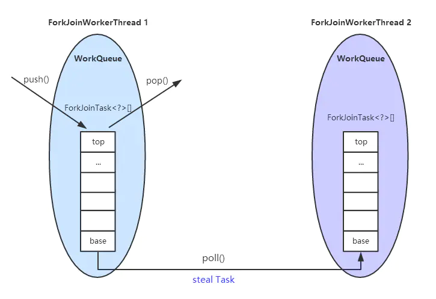
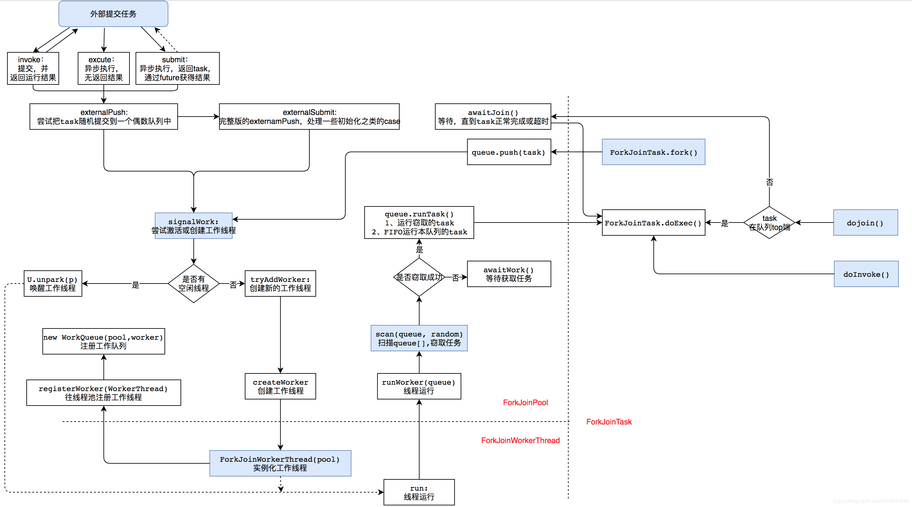
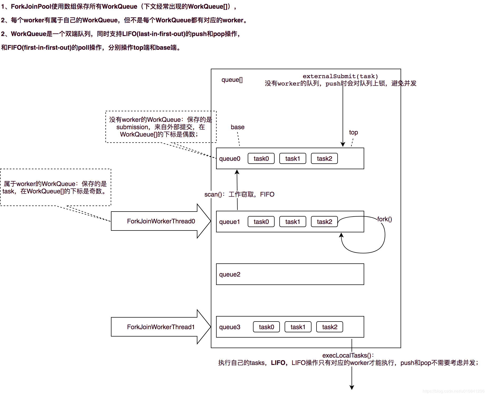
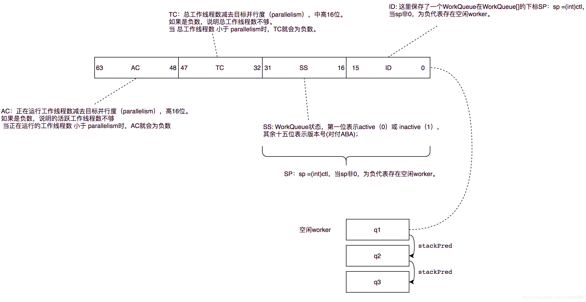

= ForkJoinPool

image::images/ForkJoinPool-fork-join.webp[]

[{java_src_attr}]
----
include::{sourcedir}/concurrent/ForkJoinPoolTest.java[]
----

== 参考资料

. https://blog.csdn.net/u010841296/article/details/83963637[ForkJoinPool实现原理和源码解析_Java_Java程序员的进阶之路-CSDN博客]
. https://segmentfault.com/a/1190000016781127[Java多线程进阶（四三）—— J.U.C之executors框架：Fork/Join框架（1） 原理 - 透彻理解Java并发编程 - SegmentFault 思否]
. https://segmentfault.com/a/1190000016877931[Java多线程进阶（四四）—— J.U.C之executors框架：Fork/Join框架（2）实现 - 透彻理解Java并发编程 - SegmentFault 思否]
. https://liuyehcf.github.io/2017/08/01/Java-concurrent-Fork-Join-%E6%BA%90%E7%A0%81%E5%89%96%E6%9E%90/[Java-concurrent-Fork-Join-源码剖析 | Liuye Blog]
. https://www.jianshu.com/p/32a15ef2f1bf[JUC源码分析-线程池篇（四）：ForkJoinPool - 1 - 简书]
. https://www.jianshu.com/p/6a14d0b54b8d[JUC源码分析-线程池篇（五）：ForkJoinPool - 2 - 简书]
