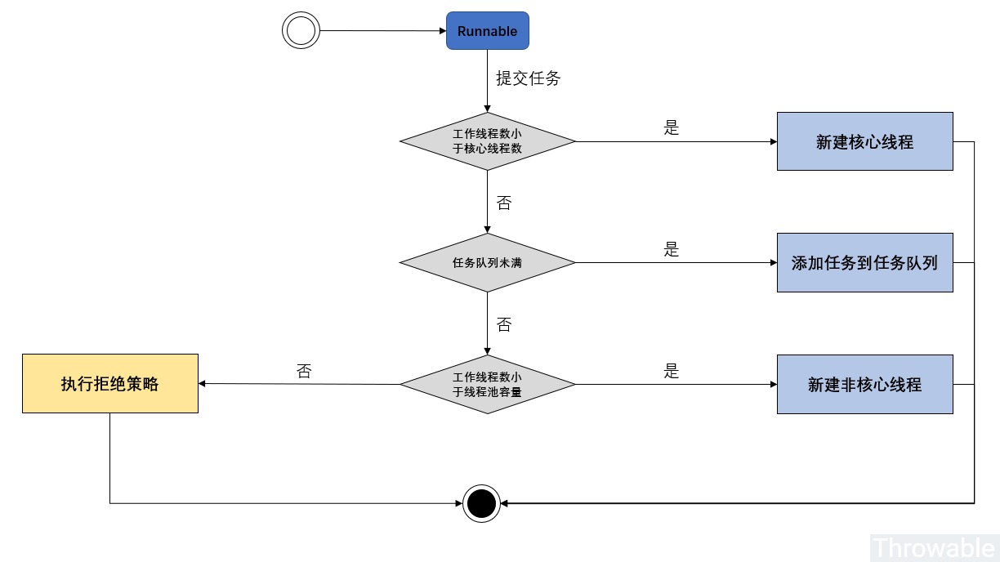

== ThreadPoolExecutor 源码分析

include::_attributes.adoc[]

[cols="9,33,9,38",options="header"]
|===
|状态名称 |比特位 |十进制 |描述

|RUNNING
|111-00000000000000000000000000000
>|-536870912
|运行中状态，可以接收新的任务和执行任务队列中的任务

|SHUTDOWN
|000-00000000000000000000000000000
>|0
|shutdown状态，不再接收新的任务，但是会执行任务队列中的任务

|STOP
|001-00000000000000000000000000000
>|536870912
|停止状态，不再接收新的任务，也不会执行任务队列中的任务，中断所有执行中的任务

|TIDYING
|010-00000000000000000000000000000
>|1073741824
|整理中状态，所有任务已经终结，工作线程数为0，过渡到此状态的工作线程会调用钩子方法 `terminated()`

|TERMINATED
|011-00000000000000000000000000000
>|1610612736
|终结状态，钩子方法 `terminated()` 执行完毕

|===

由于运行状态值存放在高3位，所以可以直接通过十进制值（甚至可以忽略低29位，直接用ctl进行比较，或者使用ctl和线程池状态常量进行比较）来比较和判断线程池的状态：工作线程数为0的前提下：`RUNNING(-536870912)` < `SHUTDOWN(0)` < `STOP(536870912)` < `TIDYING(1073741824)` < `TERMINATED(1610612736)`。

image::images/ThreadPoolExecutor-states.jpeg[]

[source,java,{source_attr}]
----
    /**
     * Executes the given task sometime in the future.  The task
     * may execute in a new thread or in an existing pooled thread.
     *
     * If the task cannot be submitted for execution, either because this
     * executor has been shutdown or because its capacity has been reached,
     * the task is handled by the current {@link RejectedExecutionHandler}.
     *
     * @param command the task to execute
     * @throws RejectedExecutionException at discretion of
     *         {@code RejectedExecutionHandler}, if the task
     *         cannot be accepted for execution
     * @throws NullPointerException if {@code command} is null
     */
    public void execute(Runnable command) {
        if (command == null)
            throw new NullPointerException();
        /*
         * Proceed in 3 steps:
         *
         * 1. If fewer than corePoolSize threads are running, try to
         * start a new thread with the given command as its first
         * task.  The call to addWorker atomically checks runState and
         * workerCount, and so prevents false alarms that would add
         * threads when it shouldn't, by returning false.
         *
         * 2. If a task can be successfully queued, then we still need
         * to double-check whether we should have added a thread
         * (because existing ones died since last checking) or that
         * the pool shut down since entry into this method. So we
         * recheck state and if necessary roll back the enqueuing if
         * stopped, or start a new thread if there are none.
         *
         * 3. If we cannot queue task, then we try to add a new
         * thread.  If it fails, we know we are shut down or saturated
         * and so reject the task.
         */
        int c = ctl.get();
        // 如果当前工作线程数小于核心线程数，则创建新的线程并执行传入的任务
        if (workerCountOf(c) < corePoolSize) {
            if (addWorker(command, true))
                // 创建核心线程成功则直接返回
                return;
            // 创建核心线程失败，则在其他任务提交时，已经创建了足够多的线程数
            // 或者线程池关闭等等，总之线程池状态已经发生变化，
            // 则更新 ctl 的临时变量
            c = ctl.get();
        }
        // 运行到这里说明创建核心线程失败，则当前工作线程已经大于等于 corePoolSize
        // 判断线程池是否运行并且尝试用非阻塞方法向任务队列中添加任务（失败则返回 false）
        if (isRunning(c) && workQueue.offer(command)) {
            int recheck = ctl.get();
            // 向任务队列投放任务成功，对线程池状态做二次检查
            // 如果线程池状态不是运行中，则从任务队列中移除任务并执行拒绝策略
            if (! isRunning(recheck) && remove(command))
                // 执行拒绝策略 -- 结束
                reject(command);
            // 走到下面的 else if 分支，则说明
            // 0、线程池可能是 RUNNING 状态
            // 1、任务移除失败（失败原因可能是任务已经被执行）
            // 如果当前线程数为0，则创建一个非核心线程并传入任务为 null -- 结束
            // 创建的线程不会马上执行任务，而是等待获取任务队列中的任务去执行
            // 如果当前线程数不为0，则什么也不做。因为任务已经成功加入队列，总会执行。
            else if (workerCountOf(recheck) == 0)
                addWorker(null, false);
        }
        // 执行到这里说明：
        // 0、线程池中的工作线程总数已经大于等于 corePoolSize
        // 1、线程池可能不是 RUNNING 状态
        // 2、线程池可能是 RUNNING 状态同时任务队列已经满了
        // 如果向任务队列投放任务失败，则会尝试创建非核心线程传入任务执行
        // 创建非核心线程失败，此时需要拒绝执行任务
        else if (!addWorker(command, false))
            // 执行拒绝策略 -- 结束
            reject(command);
    }
----

为什么需要二次检查线程池的运行状态，当前工作线程数量为 `0`，尝试创建一个非核心线程并且传入的任务对象为 `null`？这个可以看API注释：

****
如果一个任务成功加入任务队列，我们依然需要二次检查是否需要添加一个工作线程（因为所有存活的工作线程有可能在最后一次检查之后已经终结）或者执行当前方法的时候线程池是否已经 `shutdown` 了。所以我们需要二次检查线程池的状态，必要时把任务从任务队列中移除或者在没有可用的工作线程的前提下新建一个工作线程。
****

`runWorker()` 方法的核心流程：

image::images/ThreadPoolExecutor-runWorker.jpeg[]

=== 大纲

. 基本使用
  . 使用 `Executors` 创建线程池
  . 自定义任务，并提交任务
  . 获取返回结果
. 线程池的类图结构
. 创建执行线程
. 取出任务执行
. 如何实现 `invokeAny(Collection<? extends Callable<T>> tasks)` ？
. 如何实现 `invokeAny(Collection<? extends Callable<T>> tasks, long timeout, TimeUnit unit)` ?
. 如何实现 `invokeAll(Collection<? extends Callable<T>> tasks)` ?
. 如何实现 `invokeAll(Collection<? extends Callable<T>> tasks, long timeout, TimeUnit unit)` ？
. 如何判断线程超时？以及超时后如何杀掉线程？
. 如何终止任务？温柔终止？或者野蛮终止？
. 线程池在jDK5、6、7中有哪些升级变化？
. 拒绝策略

=== 核心点

. 关键参数
.. `corePoolSize`
.. `maximumPoolSize`
.. `BlockingQueue`
.. `RejectedExecutionHandler`
.. `keepAliveTime`
.. `threadFactory`
. `RejectedExecutionHandler`
.. `AbortPolicy`
.. `CallerRunsPolicy`
.. `DiscardPolicy`
.. `DiscardOldestPolicy`

在生产环境，为了避免首次调用超时，可以调用 `executor.prestartAllCoreThreads()` 预创建所有 `core` 线程，避免来一个创一个带来首次调用慢的问题。

=== 问题

. 任务添加后，如何执行？
. 一个任务执行完成后，如何在同一个线程执行下一个任务？
. 在 `corePoolSize` 比 `maximumPoolSize` 小的情况下，如何判定一个线程是否超时？并且如何删除一个线程？
. 任务添加后，
. 如何返回任务执行的结果？
. 这个线程池还有哪些可以改进的地方？比如 Guava 中提供了哪些线程池？
. 如何改造成添加任务，如果没有达到 `maxPoolSize` 则先创建线程？

==== Tomcat 改进

可不可以自己封装一个Queue，在插入时增加以下逻辑呢？

* 如果当前有空闲线程等待接客，则把任务加入队列让孩儿们去抢。
* 如果没有空闲的了，总线程数又没到达max，那就返回false，让Executor去创建线程。
* 如果总线程数已达到max，则继续把任务加入队列缓冲一下。
* 如果缓冲队列也满了，抛出拒绝异常。

.https://github.com/apache/tomcat/blob/master/java/org/apache/tomcat/util/threads/TaskQueue.java
[source,java,{source_attr}]
----
public class TaskQueue extends LinkedBlockingQueue<Runnable> {

    private transient volatile ThreadPoolExecutor parent = null;

    @Override
    public boolean offer(Runnable o) {
      //we can't do any checks
        if (parent==null) return super.offer(o);
        //we are maxed out on threads, simply queue the object
        if (parent.getPoolSize() == parent.getMaximumPoolSize()) return super.offer(o);
        //we have idle threads, just add it to the queue
        if (parent.getSubmittedCount()<=(parent.getPoolSize())) return super.offer(o);
        //if we have less threads than maximum force creation of a new thread
        if (parent.getPoolSize()<parent.getMaximumPoolSize()) return false;
        //if we reached here, we need to add it to the queue
        return super.offer(o);
    }
}
----

如何判断当前有没有空闲的线程等待接客？Tomcat 则靠扩展 `Executor`，增加一个当前请求数的计数器，在 `execute()` 方法前加1，再重载 `afterExecute()` 方法减1，然后判断当前线程总数是否大于当前请求总数就知道有咩有围观群众。

=== 需要注意的点

. 线程池如何初始化？
. 任务如何添加？
. 任务如何执行？
. 任务如何终止？
. 遇到异常如何处理？
  . 线程池队列已满，如何拒绝？
  . 任务执行过程中出现异常，如何处理？关闭该线程，重启一个吗？
  . ？？
. 任务如何存放？
. 任务存放后，如何取出来？
. 如何做到不断地一个一个执行下去？
. 为什么 `Worker` 继承 `AbstractQueuedSynchronizer` ？AQS起什么作用？是否需要先研究一下？

=== 收获

. 可以继承 `ThreadPoolExecutor`，实现 `beforeExecute()` 和 `afterExecute()` 等方法，来加入执行时的回调。类似的回调，还有 `terminated()`
. 添加任务时， `execute()` 方法的第二种情况，为什么还有再次检查？

[source,java,{source_attr}]
----
include::{sourcedir}/concurrent/ThreadPoolExecutorTest.java[]
----

=== 思考题

自己实现一个线程池。

=== 参考资料

. http://www.throwable.club/2019/07/15/java-concurrency-thread-pool-executor/[JUC线程池ThreadPoolExecutor源码分析 - Throwable's Blog]
. https://www.cnblogs.com/leesf456/p/5585627.html[【JUC】JDK1.8源码分析之ThreadPoolExecutor（一） - leesf - 博客园]
. https://mp.weixin.qq.com/s/baYuX8aCwQ9PP6k7TDl2Ww[Java线程池实现原理及其在美团业务中的实践]
. http://calvin1978.blogcn.com/articles/java-threadpool.html[Java ThreadPool的正确打开方式 | 江南白衣]
. http://calvin1978.blogcn.com/articles/tomcat-threadpool.html[Tomcat线程池，更符合大家想象的可扩展线程池 | 江南白衣]
. https://mp.weixin.qq.com/s/YAeneN-x_En55FlC2mVcaA[每天都在用，但你知道 Tomcat 的线程池有多努力吗？]
. http://www.throwable.club/2019/07/15/java-concurrency-thread-pool-executor/[JUC线程池ThreadPoolExecutor源码分析 - Throwable's Blog
. http://jindong.io/2015/03/30/java-concurrent-package-ThreadPoolExecutor/[Java并发包源码学习之线程池（一）ThreadPoolExecutor源码分析 - Jindong]
. http://my.oschina.net/zouqun/blog/407149[ThreadPoolExecutor简介与源码分析 - 邹胜群的个人页面 - 开源中国社区]
. http://onlychoice.github.io/blog/2013/09/13/java-concurrent-source-code-reading-2/[Java并发源码分析 - ThreadPoolExecutor - SHOW ME THE CODE]
. http://blog.csdn.net/xieyuooo/article/details/8718741[Java线程池架构原理和源码解析(ThreadPoolExecutor) - xieyuooo的专栏 - 博客频道 - CSDN.NET]
. http://www.cnblogs.com/skywang12345/p/java_threads_category.html[Java多线程系列目录(共43篇) - 如果天空不死 - 博客园]
.. 搞清楚了 `ctl` 的含义，高三位是状态，低29位是线程数
.. 主要属性的含义，主要方法的实现，任务添加后，三种不同的处理方式
.. 线程池状态变换
.. 线程池拒绝策略的实现
.. 带返回值的任务的实现方式，`Callable`，`Future`
. http://www.molotang.com/articles/514.html[ThreadPoolExecutor的基本使用 | 三石·道]
. http://www.molotang.com/articles/522.html[ThreadPoolExecutor的任务提交、任务处理、线程复用和维护相关源码分析 | 三石·道]
. http://www.molotang.com/articles/526.html[ThreadPoolExecutor的生命周期相关源码分析 | 三石·道]
. http://www.molotang.com/articles/553.html[ThreadPoolExecutor的任务饱和丢弃策略及源码实现 | 三石·道]
. http://ifeve.com/java-threadpool/[聊聊并发（三）Java线程池的分析和使用 | 并发编程网 - ifeve.com]
. http://www.infoq.com/cn/articles/executor-framework-thread-pool-task-execution-part-01?utm_campaign=rightbar_v2&utm_source=infoq&utm_medium=articles_link&utm_content=link_text[戏（细）说Executor框架线程池任务执行全过程（上）]
. http://www.infoq.com/cn/articles/executor-framework-thread-pool-task-execution-part-02?utm_campaign=rightbar_v2&utm_source=infoq&utm_medium=articles_link&utm_content=link_text[戏（细）说Executor框架线程池任务执行全过程（下）]
. http://blog.csdn.net/techq/article/details/6818201[ThreadPoolExecutor 源码分析 - techq’s blog - 博客频道 - CSDN.NET]
. http://blog.sina.com.cn/s/blog_753035050100wbtm.html[JAVA线程池(ThreadPoolExecutor)源码分析_journeylin_新浪博客]
. http://www.cnblogs.com/rilley/archive/2012/02/07/2341767.html[ThreadPoolExecutor源码分析 - rilley - 博客园]

