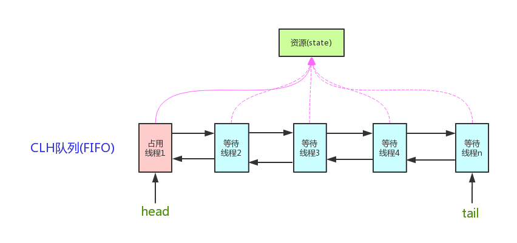

[[java.util.concurrent.locks.AbstractQueuedSynchronizer]]
= AbstractQueuedSynchronizer

Doug Lea

在 Java 5 之后，JDK 内置了大量的并发工具类。粗略去看这些工具类的源码，你会发现，大多数都在内部继承了 `AbstractQueuedSynchronizer`。由此可见，`AbstractQueuedSynchronizer` 的核心地位。想搞清楚这些并发工具类的原理，`AbstractQueuedSynchronizer` 的源码可以说是不可不看。

== CLH lock queue 介绍

终于看明白了 CLH lock queue。CLH 通过自旋来锁定当前节点。自旋的好处是线程不需要睡眠和唤醒，减小了系统调用的开销。

AQS 中线程不是一直在自旋的，而可能会反复的睡眠和唤醒，这就需要前继释放锁的时候通过 next 指针找到其后继将其唤醒，也就是 AQS 的等待队列中后继是被前继唤醒的。AQS 结合了自旋和睡眠/唤醒两种方法的优点。

_AQS 结合了自旋和睡眠/唤醒两种方法的优点。_ 这句话该如何理解？刚刚想到的一点： AQS 中会先自旋两次，如果不成功则休眠。应该是这样来使用两者的好处！

自己实现一个 CLH 锁！

== 核心点

. 模板方法模式
.. `boolean tryAcquire(int arg)`
.. `boolean tryRelease(int arg)`
.. `int tryAcquireShared(int arg)`
.. `boolean tryReleaseShared(int arg)`
.. `boolean isHeldExclusively()`

基于 `AbstractQueuedSynchronizer`，我们实现一个互斥锁：

[{java_src_attr}]
----
include::{sourcedir}/concurrent/Mutex.java[]
----

互斥锁，也可以称为独占锁，顾名思义就是同一个时刻只能有一个线程获取到锁，而其他获取锁的线程只能在同步队列中等待，只有获取锁的线程释放了锁，后继的线程才能获取锁。

[{java_src_attr}]
----
include::{sourcedir}/concurrent/AbstractQueuedSynchronizerTest.java[]
----

运行结果显示，指定时刻，只有一个线程在运行。

查看 `AbstractQueuedSynchronizer` 继承关系可以看出，在 `ReentrantLock`，`ReentrantReadWriteLock` 和 `Semaphore` 三个类中实现了公平锁和非公平锁。

== `Node` 详解

* `waitStatus`：当前 `Node` 的等待状态，有五个可选值。
* `prev`：当前 `Node` 实例的前驱节点引用。
* `next`：当前 `Node` 实例的后继节点引用。
* `thread`：当前 `Node` 实例持有的线程实例引用。
* `nextWaiter`：这个值是一个比较容易令人生疑的值，虽然表面上它称为"下一个等待的节点"，但是实际上它有三种取值的情况。
.. 值为静态实例 `Node.EXCLUSIVE`(也就是 `null`)，代表当前的 `Node` 实例是独占模式。
.. 值为静态实例 `Node.SHARED`，代表当前的 `Node` 实例是共享模式。
.. 值为非 `Node.EXCLUSIVE` 和 `Node.SHARED` 的其他节点实例，代表 `Condition` 等待队列中当前节点的下一个等待节点。

=== `Node` 中一些常量定义

区分共享锁还是独占式锁的常量，是如何被使用的？独占锁为何没有初始化？

. `static final Node SHARED = new Node();`
. `static final Node EXCLUSIVE = null;` -- 为何没有被初始化？

共享锁的话，大家使用同一个 `Node` 实例，而独自锁则是每个任务使用一个 `Node` 实例。可以这样理解吗？

节点的状态

. `static final int CANCELLED =  1;` -- 表示当前的线程被取消；
. `static final int SIGNAL    = -1;` -- 表示当前节点的后继节点包含的线程需要运行，也就是unpark；
. `static final int CONDITION = -2;` -- 表示当前节点在等待condition，也就是在condition队列中；
. `static final int PROPAGATE = -3;` -- 表示当前场景下后续的acquireShared能够得以执行；
. `0` -- 表示当前节点在sync队列中，等待着获取锁。

模板方法：

. `isHeldExclusively()` -- 该线程是否正在独占资源。只有用到condition才需要去实现它。
. `tryAcquire(int)` -- 独占方式。尝试获取资源，成功则返回true，失败则返回false。
. `tryRelease(int)` -- 独占方式。尝试释放资源，成功则返回true，失败则返回false。
. `tryAcquireShared(int)` -- 共享方式。尝试获取资源。负数表示失败；0表示成功，但没有剩余可用资源；正数表示成功，且有剩余资源。
. `tryReleaseShared(int)` -- 共享方式。尝试释放资源，成功则返回true，失败则返回false。

== 独占模式

独占模式的同步器的一个显著特点就是：头节点的第一个有效(非取消)的后继节点，总是尝试获取资源，一旦获取资源成功就会解除阻塞并且晋升为头节点，原来所在节点会移除出同步等待队列，原来的队列长度就会减少1，然后头结点的第一个有效的后继节点继续开始竞争资源。

[{java_src_attr}]
----
    /**
     * Checks and updates status for a node that failed to acquire.
     * Returns true if thread should block. This is the main signal
     * control in all acquire loops.  Requires that pred == node.prev.
     *
     * @param pred node's predecessor holding status
     * @param node the node
     * @return {@code true} if thread should block
     */
    private static boolean shouldParkAfterFailedAcquire(Node pred, Node node) {
        // 如果前一个节点已经在排队，则新加入的节点就应该 park
        int ws = pred.waitStatus;
        if (ws == Node.SIGNAL)
            /*
             * This node has already set status asking a release
             * to signal it, so it can safely park.
             */
            return true;
        // 如果前一个节点已经取消，则删除取消节点
        if (ws > 0) {
            /*
             * Predecessor was cancelled. Skip over predecessors and
             * indicate retry.
             */
            // 跳过已经取消的节点
            do {
                node.prev = pred = pred.prev;
            } while (pred.waitStatus > 0);
            // 加入队列
            pred.next = node;
        } else {
            /*
             * waitStatus must be 0 or PROPAGATE.  Indicate that we
             * need a signal, but don't park yet.  Caller will need to
             * retry to make sure it cannot acquire before parking.
             */
            // 如果前一个节点没有取消，则尝试将前一个节点设置为 Node.SIGNAL
            pred.compareAndSetWaitStatus(ws, Node.SIGNAL);
        }
        return false;
    }

    /**
     * Convenience method to interrupt current thread.
     */
    static void selfInterrupt() {
        Thread.currentThread().interrupt();
    }

    /**
     * Convenience method to park and then check if interrupted.
     *
     * @return {@code true} if interrupted
     */
    private final boolean parkAndCheckInterrupt() {
        LockSupport.park(this);
        return Thread.interrupted();
    }

    /*
     * Various flavors of acquire, varying in exclusive/shared and
     * control modes.  Each is mostly the same, but annoyingly
     * different.  Only a little bit of factoring is possible due to
     * interactions of exception mechanics (including ensuring that we
     * cancel if tryAcquire throws exception) and other control, at
     * least not without hurting performance too much.
     */

    /**
     * Acquires in exclusive uninterruptible mode for thread already in
     * queue. Used by condition wait methods as well as acquire.
     *
     * @param node the node
     * @param arg the acquire argument
     * @return {@code true} if interrupted while waiting
     */
    final boolean acquireQueued(final Node node, int arg) {
        boolean interrupted = false;
        try {
            for (;;) {
                final Node p = node.predecessor();
                if (p == head && tryAcquire(arg)) {
                    setHead(node);
                    p.next = null; // help GC
                    return interrupted;
                }
                // 此时 node 节点已经通过 addWaiter 方法加入到队列中
                // 1、如果前一个节点是 SIGNAL，则返回 true，park 该线程
                // 2.1 如果前一个节点取消，则通过遍历将之前的连续的取消节点全部删除，
                //     返回 false，再次自旋尝试获取锁
                // 2.2 如果前一个节点没有取消，则将前一个节点尝试修改为 SIGNAL。
                //     那么下一次循环时，走第一个判断，返回 true，park 该线程。
                //     或者前驱节点已经弹出队列，则该线程尝试获取锁。
                if (shouldParkAfterFailedAcquire(p, node))
                    interrupted |= parkAndCheckInterrupt();
            }
        } catch (Throwable t) {
            cancelAcquire(node);
            if (interrupted)
                selfInterrupt();
            throw t;
        }
    }
----

可以画一下流程图：

. 以 `ReentrantLock` 为例，在独占模式下，获取锁的过程
. 以 `ReentrantLock` 为例，在独占模式下，释放锁的过程
. 使用 `Condition` 对象，`await()` 的过程
. 使用 `Condition` 对象，`signal()` 的过程
. 以 `Semaphore` 为例，在共享模式下，获取锁的过程
. 以 `Semaphore` 为例，在共享模式下，释放锁的过程

== 共享模式

共享模式的同步器的一个显著特点就是：头节点的第一个有效(非取消)的后继节点，总是尝试获取资源，一旦获取资源成功就会解除阻塞并且晋升为头节点，原来所在节点会移除出同步等待队列，原来的队列长度就会减少1，重新设置头节点的过程会传播唤醒的状态，简单来说就是唤醒一个有效的后继节点，只要一个节点可以晋升为头节点，它的后继节点就能被唤醒。节点的唤醒顺序遵循类似于FIFO的原则，通俗说就是先阻塞或者阻塞时间最长则先被唤醒。

== `ConditionObject`

关于这段代码的研究，可以参看 xref:java.util.concurrent.ArrayBlockingQueue.adoc[`java.util.concurrent.ArrayBlockingQueue`]。`ArrayBlockingQueue` 在实现 `poll(long, java.util.concurrent.TimeUnit)` 方法时，使用了 `Condition notEmpty` 对象来调用 `ConditionObject.awaitNanos(long)` 方法。

== 参考资料

WARNING: 访问一些页面时发现一些页面已经不能访问了，后续再搜索补上吧。

. http://www.throwable.club/2019/04/07/java-juc-aqs-source-code/[JUC同步器框架AbstractQueuedSynchronizer源码图文分析 - Throwable's Blog]
. https://www.cnblogs.com/dennyzhangdd/p/7218510.html[《The java.util.concurrent Synchronizer Framework》 JUC同步器框架（AQS框架）原文翻译 - 只会一点java - 博客园]
. https://www.cnblogs.com/waterystone/p/4920797.html[Java并发之AQS详解 - waterystone - 博客园]
. https://www.cnblogs.com/chengxiao/archive/2017/07/24/7141160.html[Java并发包基石-AQS详解 - dreamcatcher-cx - 博客园]

. http://www.cnblogs.com/leesf456/p/5350186.html[【JUC】JDK1.8源码分析之AbstractQueuedSynchronizer（二） - leesf - 博客园]
. http://www.infoq.com/cn/articles/jdk1.8-abstractqueuedsynchronizer[深度解析Java 8：JDK1.8 AbstractQueuedSynchronizer的实现分析（上）]
. http://www.infoq.com/cn/articles/java8-abstractqueuedsynchronizer[深度解析Java 8：AbstractQueuedSynchronizer的实现分析（下）]
. http://www.molotang.com/articles/480.html[Lock、ReentrantLock和AbstractQueuedSynchronizer的源码要点分析整理 | 三石·道]
. http://zhanjindong.com/2015/03/10/java-concurrent-package-aqs-overview[Java并发包源码学习之AQS框架（一）概述 - Jindong Zhan]
. http://zhanjindong.com/2015/03/11/java-concurrent-package-aqs-clh-and-spin-lock[Java并发包源码学习之AQS框架（二）CLH lock queue和自旋锁 - Jindong Zhan]
. http://zhanjindong.com/2015/03/14/java-concurrent-package-aqs-locksupport-and-thread-interrupt[Java并发包源码学习之AQS框架（三）LockSupport和interrupt - Jindong Zhan]
. http://zhanjindong.com/2015/03/15/java-concurrent-package-aqs-AbstractQueuedSynchronizer[Java并发包源码学习之AQS框架（四）AbstractQueuedSynchronizer源码分析 - Jindong Zhan]
. http://ifeve.com/introduce-abstractqueuedsynchronizer/[AbstractQueuedSynchronizer的介绍和原理分析 | 并发编程网 - ifeve.com]
. http://coderbee.net/index.php/concurrent/20131209/614[JUC 源码分析 一 AbstractQueuedSynchronizer | 码蜂笔记]
. http://www.hiyangqi.com/java%20concurrency/java-concurrency-AQS.html[Java 多线程基本工具的原理AQS]
. http://www.tqcto.com/article/internet/5807.html[JUC 源码分析 3 AbstractQueuedSynchronizer 共享模式 与 CountDownLatch - 互联网 - 爱上编程技术博客]
. http://jiangwenfeng762.iteye.com/blog/1293814[通过CountDownLatch来分析AbstractQueuedSynchronizer的源码 - - ITeye技术网站]

