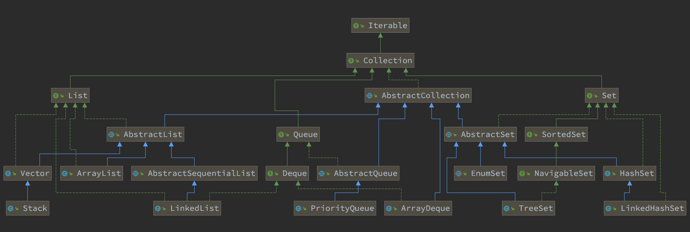
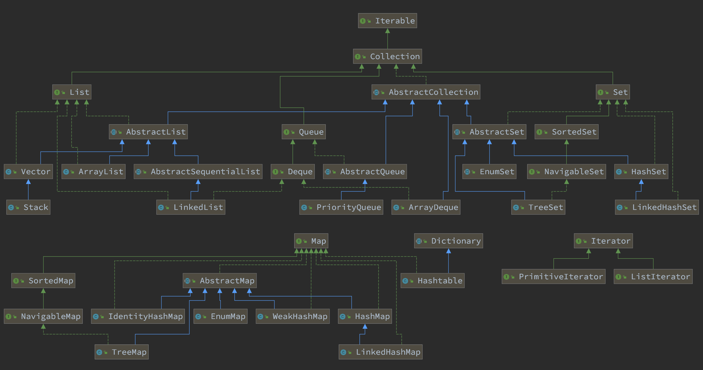

= JDK & STL 源码分析计划

== 总体思路

. 学习基本的数据结构认识。兵马未动粮草先行。先把基础理论搞清楚。
.. 学Java的，可以从下面两本书中选一本：
... https://book.douban.com/subject/26745780/[数据结构与算法分析] -- 这本书的优点在于和 Java JDK 的集合类很贴近。
... https://book.douban.com/subject/19952400/[算法（第4版）] -- 这本书胜在图很多。
.. 学 C/C++ 的，可以看下面这套书：
... https://book.douban.com/subject/4065258/[算法：C语言实现 (第1～4部分)]
... https://book.douban.com/subject/4191525/[算法：C语言实现 （第5部分）]
. 自己实现一遍基本的数据结构；
. 阅读 JDK 或 STL 源码，做学习笔记。
+
TIP: 对比一下自己的实现和这些经典代码的实现，总结自己差距，提高自己的编码能力。
+
.. https://book.douban.com/subject/1110934/[STL源码剖析 ] -- 阅读源码时，建议参考一下本书的内容。
.. 建议把网上的源码分析笔记都看一看，取长补短，补充自己的分析。
.. 建议把网上相关面试题也看一看，检验自己的学习成果。
. 相关联的 LeetCode 上的题都刷掉。

[NOTE]
====
还有两个想法：

. 可以把 Redis 的实现也过一下，Redis 实现也有很多不错的思路。毕竟 Redis 是目前最常用的缓存解决方案。
. Java 中有很多针对集合类做扩展的库，可以一并学了，这样就能更清楚了解 Java JDK 实现的不足，开阔自己的眼界：
.. https://github.com/google/guava[google/guava: Google core libraries for Java]
.. https://commons.apache.org/proper/commons-collections/[Apache Commons Collections]
.. https://www.eclipse.org/collections/[Eclipse Collections - Features you want with the collections you need.]
====

== JDK 集合类

*Base*::
. `java.lang.Iterable`
. `java.util.Collection`
. `java.util.AbstractCollection`

*List*::
. `java.util.List`
. `java.util.AbstractList`
. `java.util.AbstractSequentialList`
. `java.util.LinkedList`
. `java.util.Vector`
. `java.util.Stack`
. `java.util.ArrayList`

*Queue*::
. `java.util.Queue`
. `java.util.Deque`
. `java.util.AbstractQueue`
. `java.util.ArrayDeque`
. `java.util.PriorityQueue`

*Set*::
. `java.util.Set`
. `java.util.AbstractSet`
. `java.util.SortedSet`
. `java.util.EnumSet`
. `java.util.NavigableSet`
. `java.util.HashSet`
. `java.util.TreeSet`
. `java.util.LinkedHashSet`

*Map*::
. `java.util.Map`
. `java.util.SortedMap`
. `java.util.NavigableMap`
. `java.util.AbstractMap`
. `java.util.TreeMap`
. `java.util.WeakHashMap`
. `java.util.EnumMap`
. `java.util.IdentityHashMap`
. `java.util.LinkedHashMap`
. `java.util.HashMap`
. `java.util.Dictionary`
. `java.util.Hashtable`

image::java.util.Map.png[]

*Iterator*::
. `java.util.Iterator`
. `java.util.PrimitiveIterator`
. `java.util.ListIterator`

来张总体结构图：

TIP: 这里没有包含并发相关的集合类。这块内容放到并发中一起搞。

